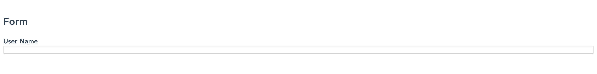

# VueJSONSchemaForm (0.1.6)

A vuejs component for rendering JSON Schema as forms.

# Quick Start

You will need a vuejs project to use this component. You can create a new project if you dont have one using [@vue/cli](https://cli.vuejs.org/).

## Installation

You must have access to the private [npm registry](http://www.google.com) of livspace to download this package.

```bash
  npm i --save @canvas/vuejsonschemaform
```

## Usage

If you have a webpack project already setup you can now import and use the component.

__Template section__: The most minimal template you can have will have just a schema (`formstructure`) and the `renderers`. You can import the renderers that are bundled with the package, define your own or extend existing ones. For more on renderers check the [Custom Renderers](/vuejsonschemaform?id=custom-renderers) section.
```html
<div>
  <Form
    :schema="formstructure"
    :renderers="renderers"
  />
</div>
```

__Script section__: Even if you have the schema available at compile time, use the mounted method to update the schema property starting from a blank object. This is required because there is a watcher in the `Form` component that does some processing when the schema changes. This is an issue which will be fixed in an upcoming release.

For the structure of the schema refer to the [Available Renderers](/vuejsonschemaform?id=available-renderers) section.
```javascript
import { Form, CustomRenderers } from '@canvas/vuejsonschemaform';
export default Vue.extend({
  components: {
    Form,
  },
  data() {
    return {
      schema: {},
    };
  },
  mounted() {
    this.schema = {
      title: 'Form',
      type: 'object',
      properties: {
        username: {
          type: 'string',
          title: 'User Name'
        },
      },
    };
  },
  computed: {
    renderers() {
      return CustomRenderers;
    },
  },
});
```

__Style section__: You must also import the style bundle from the distribution if
you are using the bundled renderers. To do this you have to specify the path of the
css file in the `node_modules` folder that was created when you installed this component.
```css
@import url('../../node_modules/@canvas/vuejsonschemaform/dist/vuejsonschemaform.css');
```
If you are using typescript, you may get an error saying `Could not find a declaration file for module '@canvas/vuejsonschemaform'...`. At this time we do not have a type
declaration file available for vuejsonschemaform. So, just create a file named
`vuejsonschemaform.d.ts` in the src folder and add the line
`declare module '@canvas/vuejsonschemaform';` in it. A declaration file will be
published soon to fix this issue.

If everything went well, depending on your global css you should see something like
this:


# Rendering
Understanding the rendering process of this component is crucial if you want to use your own components. If you would just be using the form to render some schemas using the included renderers then skip ahead to the [Included renderers](/vuejsonschemaform?id=included-renderers) section.

## Rules
The `renderers` attribute on `Form` takes an object of the form:
```javascript
{
  '*': {
    string: renderString,
    number: renderNumber,
    object: renderObject
  },
  '/budget': {
    number: renderIntegerInput
  }
}
```

This object has a wildcard \* which matches with all components in the json. The component traverses the schema until it finds a `type` or `component` attribute. Then it looks for a matching renderer in the object by first checking if a match for its current path exists and then falling back to the wildcard. So for example in the following schema:

```javascript
{
  title: 'Form',
  type: 'object',
  properties: {
    name: {
      title: 'Name',
      type: 'string'
    },
    age: {
      title: 'Age',
      type: 'number'
    },
    budget: {
      title: 'Budget Range',
      type: 'number'
    }
  }
}
```

Then the following renderers will be used to render each component:
+ top level 'object' -> `renderObject`
+ 'name' -> `renderString`
+ 'age' -> `renderNumber` (a number type rendered using wildcard renderer)
+ 'budget' -> `renderIntegerInput` (a number type rendered with a more specific renderer because of a more specific path match)

If your form is complex enough that neither just having a renderer for each type, nor having the option to set new renderers for the same type on different paths is enough then you can use the `component` attribute to specify renderers.

Note that this property is not part of the JSON Schema 7 specification. So it is not strictly adhering to the spec. But it may be worth the convenience to break that.

Also, note that even if you use the  `component` attribute, validators like ajv will still treat your shema as valid.

An example of using the `component` attribute in the schema and the accompanying customrenderer.

```javascript
{
  '*': {
    string: renderString,
    textarea: renderStringAsTextArea
  }
}
```

```javascript
{
  title: 'Form',
  type: 'object',
  properties: {
    description: {
      title: 'Description',
      type: 'string',
      component: 'textarea'
    }
  }
}
```

So, in this case the component will see that:
1. No path specific renderers so fallback to wildcards
2. In the component there is both the `type` and `component` it will try to resolve the renderer using the value of the `component` attribute. If no `component` attribute was present it would have fallen back to `type` attribute.
3. For the value of the `component` attibute, i.e. 'textarea' it will find the renderer function `renderStringAsTextArea` and thus render the component as a `<textarea>`

Note that you can just ignore the `type` attibute and always set the `component` attribute if you like.

## Included renderers
Here is a complete list of renderers bundled with vuejsonschemaform.
```javascript
{
  '*': {
    string: renderString,
    number: renderNumber,
    array: renderArray,
    apiselect: renderApiSelect,
    dynamicapiselect: renderDynamicApiSelect,
    radio: renderRadio,
    select: renderSelect,
    checkbox: renderCheckboxes,
    multiselect: renderMultiselect,
    boolean: renderSwitch,
    monthpicker: renderMonthpicker,
    daterange: renderDateRange,
    multipleupload: renderMultipleUpload,
    upload: renderSingleFileUpload,
    datepicker: renderDatePicker,
    datetimepicker: renderDateTimePicker,
    time: renderTimePicker,
    multiselectpills: renderPills,
    verticalmultiselectpills: renderVerticalPills,
    accordion: renderAccordion,
    verticalbodyaccordion: renderVerticalBodyAccordion,
    address: renderObjectAsAddressForm,
    basicaddress: renderObjectAsBasicAddressForm,
    pancarduploader: renderArrayAsPancardUploader,
    intlphonenumber: renderInternationalPhone,
    tagsinput: renderTagsInput,
    textarea: renderTextarea,
    familydetailcomponent: renderFamilyDetailComponent,
    singleselectpills: renderSingleSelectPills,
    maps: mapsRenderer,
    gstincollector: renderGstinCollector,
    object: renderObject,
    leadeditor: renderLeadEditor,
    statusComponent: RenderstatusComponent,
    multiselectpresales: renderBouncerUserSearchPresales,
    familydetaillabels: renderFamilyDetailsLabels,
  }
}
```

We will see an example of how to use each of these now.


# Conditional rendering
You can handle conditional showing hiding of form elements using the conditional
schema constructs of JSONSchema 7 specification.

# Custom renderers
The component renders the schema recursively. At each call control is passed to
a renderer and then back to the caller. You can introduce your own renderers in
case you want to use this to render your components.

If you are using canvas components you should share the renderers that are available
or contribute the components library. Do not add your component in your own project
alone to ensure continued support and upgrades.

If its your own project then make sure you use css modules so that no changes on
our side can affect your components.

To write a custom renderer do the following:
```typescript
// Your renderer.tsx
function renderMyComponent(this: From, ) {

}
```

# Leveraging tree transformers (coming soon)
You can get transform data in one json object to another using the schema as a key.
To do this you must use the following functions.

## Date picker
